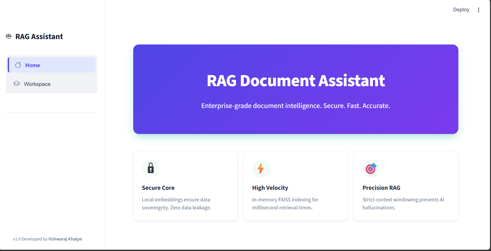
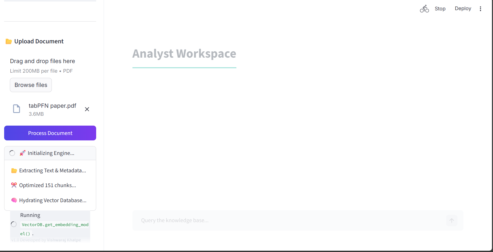
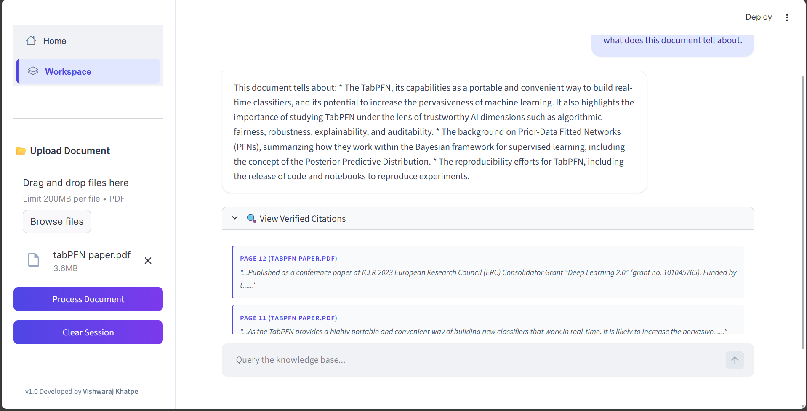

# 🤖 RAG Document Assistant (v1.0)

[](https://github.com/vishwarajkhatpe/RAG-Document-Assistant/releases/tag/v1.0)


**An Enterprise-Grade Document Intelligence Engine.** Securely analyze and chat with your PDF documents using local vector embeddings and the reasoning power of Google's **Gemini 2.5 Flash** model.

---

## 🚀 Key Features

* **🔒 Privacy-First Architecture:** Utilizes `all-MiniLM-L6-v2` to generate vector embeddings **locally on your CPU**. Sensitive document data is never sent to third-party vector cloud providers.

* **⚡ Gemini 2.5 Powered:** Integrated with Google's latest **Gemini 2.5 Flash** model via REST API for high-velocity, accurate reasoning and context awareness.

* **📚 Verified Citations:** Implements a "Trust but Verify" protocol. Every AI response includes exact **page numbers and text snippets** from the source PDF to eliminate hallucinations.

* **🧠 Optimized Memory Management:** Features explicit garbage collection and session state handling to process large enterprise documents without exhausting RAM.

* **🎨 Professional UX:** A polished Streamlit interface featuring a "Royal Indigo" theme, granular progress tracking, and resilient error handling.

---

## 🛠️ Technical Architecture

| Component | Technology | Description |
| :--- | :--- | :--- |
| **Frontend** | Streamlit | Responsive UI with custom CSS styling and toast notifications. |
| **Orchestration** | LangChain (v0.1) | Chain management for Retrieval Augmented Generation (RAG). |
| **LLM** | Google Gemini 2.5 | High-performance inference model accessed via Google GenAI SDK. |
| **Vector DB** | FAISS (CPU) | In-memory similarity search for sub-millisecond context retrieval. |
| **Embeddings** | HuggingFace | Local `sentence-transformers` for zero-latency vectorization. |
| **Processing** | PyPDF | Robust, page-by-page text extraction and metadata preservation. |

---

## 📂 Project Structure

```text

RAG-Document-Assistant/
├── src/
│   ├── pdf_handler.py    # Enterprise-grade PDF extraction & chunking logic
│   ├── vector_db.py      # FAISS vector store & embedding management
│   ├── rag_chain.py      # Gemini 2.5 configuration & strict prompting
│   └── ui_utils.py       # UI components & CSS styling engine
├── app.py                # Main application entry point
├── requirements.txt      # Production dependency lockfile
├── Dockerfile            # Container configuration
├── .env                  # API Key configuration (GitIgnored)
└── README.md             # Project documentation
```

---
## 📸 Application Interface

<p align="center">
  
</p>

| **Processing Engine** | **Verified Citations** |
|:---:|:---:|
|  |  |

---

## ⚙️ Deployment Guide

You can run the application locally via Python or deploy it as a Docker container.

### Option A: Local Python Setup

**1. Clone the Repository**

```bash
# Clone the repository
git clone https://github.com/vishwarajkhatpe/RAG-Document-Assistant.git
cd RAG-Document-Assistant

# Checkout the stable v1.0 release
git checkout v1.0
```

**2. Environment Setup**

```bash
# Windows
python -m venv venv
.\venv\Scripts\activate

# Mac/Linux
python3 -m venv venv
source venv/bin/activate
```
**3. Install Dependencies**
```bash
pip install -r requirements.txt
```
**4. Configuration Create a .env file in the root directory:**
```ini, TOML
GOOGLE_API_KEY=your_actual_api_key_here
```

**5. Launch**
```bash
streamlit run app.py
```

---

### Option B: Docker Deployment 🐳

Ensure Docker Desktop is running before proceeding.

**1. Build the Image**
```bash
docker build -t rag-document-assistant .
```

**2. Run the Container** 
This command passes your local .env file into the container.
```bash
docker run -p 8501:8501 --env-file .env rag-document-assistant
```
Access the application at http://localhost:8501

---

## 📸 Application Interface

The application features a clean, two-panel layout:
1.  **Home:** Landing page explaining core value propositions.
2.  **Workspace:** The active analyst dashboard for uploading files and querying the knowledge base.

---

## 🔮 Future Roadmap

* [ ] **Multi-Format Support:** Add ingestion pipelines for `.docx`, `.txt`, and `.md` files.
* [ ] **Session Persistence:** Implement SQLite database to save chat history across sessions.
* [ ] **Hybrid Search:** Combine keyword-based search (BM25) with vector search for higher accuracy.

---

## ✍️ Author

**Vishwaraj Khatpe** *Final Year Engineering Student (AIML)* [GitHub Profile](https://github.com/vishwarajkhatpe)
