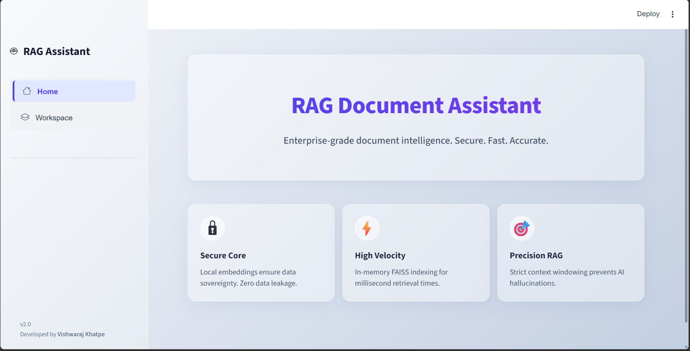
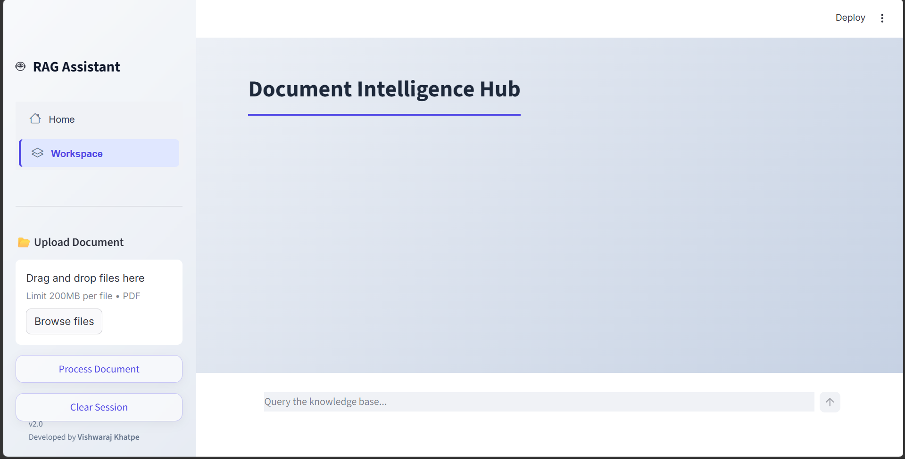
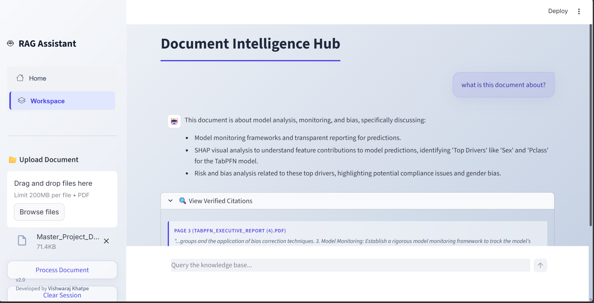

# 🤖 RAG Document Assistant (v2.0)

[](https://rag-document-assistant-v2.streamlit.app/)
[](https://github.com/vishwarajkhatpe/RAG-Document-Assistant/releases/tag/v2.0)


**An Enterprise-Grade Document Intelligence Engine.** Securely analyze and chat with your PDF documents using 100% local CPU vector embeddings and the reasoning power of Google's **Gemini 2.5 Flash** model. 

Version 2.0 introduces a state-of-the-art **Glassmorphism UI**, true real-time LLM streaming, and persistent vector storage.

---

## 🚀 What's New in v2.0?

*   **✨ Glassmorphism Interface:** A complete visual overhaul featuring frosted glass sidebars, translucent interactive feature cards, ambient mesh gradients, and fluid `slideUp` micro-animations.
*   **⚡ True Real-Time Streaming:** Replaced simulated typewriter effects with native LangChain callback streaming. Watch Gemini 2.5 generate tokens on your screen instantaneously with zero artificial latency.
*   **💾 Persistent Vector Storage:** The FAISS index is now automatically persisted to your local disk (`/faiss_index`). Refreshing the browser no longer requires you to re-upload and re-process large PDF documents!
*   **🏎️ Optimized Initialization:** Caching improvements in the Streamlit session state mean the LLM chain is only initialized once, drastically reducing overhead on subsequent chat queries.

---

## 🌟 Core Features

*   **🔒 True Data Sovereignty:** Utilizes HuggingFace's `all-MiniLM-L6-v2` to generate vector embeddings **100% locally on your CPU**. Sensitive document content is never sent to third-party embedding providers.
*   **📚 Verified Citations:** Implements a strict "Trust but Verify" prompt protocol. Every AI response includes exact **page numbers and text snippets** extracted directly from the source PDF to eliminate AI hallucinations.
*   **🧠 Intelligent Context Windowing:** Employs LangChain's `RecursiveCharacterTextSplitter` to optimize chunk overlap, ensuring Gemini 2.5 receives perfect semantic context.

---

## 🛠️ Technical Architecture

| Component | Technology | Description |
| :--- | :--- | :--- |
| **Frontend** | Streamlit | Responsive UI featuring a custom Glassmorphism CSS styling engine. |
| **Orchestration** | LangChain (v0.1) | RAG chain management, caching, and stream callback handlers. |
| **LLM** | Google Gemini 2.5 | High-performance inference model configured for max determinism (Temp 0.1). |
| **Vector DB** | FAISS (CPU) | High-speed similarity search with local disk serialization capabilities. |
| **Embeddings** | HuggingFace | Local `sentence-transformers` for zero-leakage document vectorization. |
| **Processing** | PyPDF | Robust page-by-page text extraction with error-tolerant skipping. |

---

## 📸 Application Interface (v2.0)

<p align="center">
  
</p>

| **Knowledge Base Ingestion** | **Interactive Chat & Citations** |
|:---:|:---:|
|  |  |

---

## ⚙️ Deployment Guide

You can run the application locally via Python or deploy it as an isolated Docker container.

### Option A: Local Python Setup

**1. Clone the Repository**

```bash
git clone https://github.com/vishwarajkhatpe/RAG-Document-Assistant.git
cd RAG-Document-Assistant

# Checkout the stable v2.0 release
git checkout v2.0
```

**2. Environment Setup**

```bash
# Windows
python -m venv venv
.\venv\Scripts\activate

# Mac/Linux
python3 -m venv venv
source venv/bin/activate
```

**3. Install Dependencies**
```bash
pip install -r requirements.txt
```

**4. Configuration** 
Create a `.env` file in the root directory:
```ini
GOOGLE_API_KEY=your_actual_api_key_here
```

**5. Launch**
```bash
streamlit run app.py
```

---

### Option B: Docker Deployment 🐳

Ensure Docker Desktop is running before proceeding.

**1. Build the Image**
```bash
docker build -t rag-document-assistant .
```

**2. Run the Container** 
This command seamlessly passes your local `.env` file into the container.
```bash
docker run -p 8501:8501 --env-file .env rag-document-assistant
```
Access the application at `http://localhost:8501`

---

## 🔮 Future Roadmap

*   [ ] **Multi-Format Support:** Add ingestion pipelines for `.docx`, `.txt`, and `.md` files.
*   [ ] **Hybrid Search:** Combine keyword-based sparse search (BM25) with dense vector search for higher keyword accuracy.
*   [ ] **OCR Integration:** Integrate `pytesseract` to parse scanned enterprise PDFs without selectable text.

---

## ✍️ Author

**Vishwaraj Khatpe** *Final Year Engineering Student (AIML)* | [GitHub Profile](https://github.com/vishwarajkhatpe)
